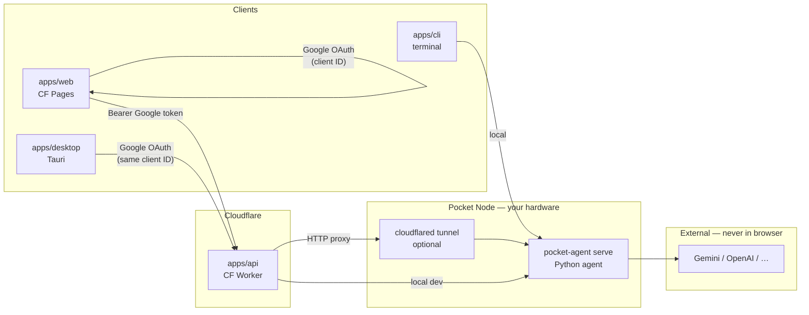

# Pocket Agent — Apps architecture

How the monorepo clients connect to the local Python agent. **No Supabase** — Google OAuth uses a single **Google Cloud OAuth client** shared by the web app (Cloudflare Pages) and the Tauri desktop app.

## Topology



## Request flow (hosted web)

1. User opens the **web app** on Cloudflare Pages.
2. User signs in with **Google** (OAuth client ID in the React app — no Supabase).
3. Web sends user actions to the **API worker** (`VITE_API_BASE_URL`) with the Google access token.
4. Worker **verifies the token** with Google and checks the client ID.
5. Worker **proxies** to the Pocket Node:
   - **Production:** URL from **Cloudflare Tunnel** (or configured `pocket_node.tunnel_url`).
   - **Local dev:** `http://127.0.0.1:8787` (`pocket-agent serve`).
6. Python agent runs tools, LLM calls, file access — keys stay on the Pocket Node.

## Deploy targets

| App | Path | Deploy | Install |
|-----|------|--------|---------|
| Web | `apps/web` | Cloudflare Pages | Browser |
| API | `apps/api` | Cloudflare Worker | Cloudflare |
| Desktop | `apps/desktop` | — | macOS / Windows / Linux |
| CLI | `apps/cli` | — | Desktop terminal |
| Agent | `src/pocket_agent` | Pocket Node | Same machine as NAS |

## Google Cloud OAuth app

One OAuth 2.0 **Web client** (and Tauri desktop redirect URIs when needed):

| Setting | Examples |
|---------|----------|
| Authorized JavaScript origins | `http://localhost:5173`, `https://your-app.pages.dev` |
| Authorized redirect URIs | Vite/Tauri OAuth callback URLs per app template |

Both **web** and **desktop** use the same Google client ID so tokens are issued for the same project.

## Cloudflare Tunnel (Pocket Node exposure)

For the hosted web UI to reach a home/NAS agent:

1. Run `pocket-agent serve` on the Pocket Node.
2. Run `cloudflared tunnel` pointing to `localhost:8787`.
3. Configure the API worker with the tunnel hostname (env / `config/apps.yaml` `pocket_node.tunnel_url`).

The tunnel exposes only the agent HTTP API — not raw LLM provider endpoints.

## Monorepo init

Clone nested app repositories:

```bash
pip install -e ".[dev]"
pocket-agent init              # web + api (cli when enabled)
pocket-agent init --only api   # api scaffold only
./scripts/init-apps.sh         # shell wrapper
```

Repos (see `config/apps.yaml`):

| Key | Repository |
|-----|------------|
| `web` | `pocket-agent/pocket-agent-web-app` |
| `api` | `pocket-agent/pocket-agent-api-app` |
| `cli` | `pocket-agent/pocket-agent-cli` (future) |

Each app keeps its own `.git` inside `apps/<name>/`.

## Local dev (all on one machine)

```bash
# 1. Pocket Node
pocket-agent serve

# 2. API worker (after template lands)
cd apps/api && npm run dev   # or wrangler dev

# 3. Web
cd apps/web && bun run dev
```

Set `VITE_API_BASE_URL` to the worker dev URL (not the Python agent directly in production topology; local templates may allow direct agent URL for simpler dev).

## Migration note

The current `apps/web` template may still reference Supabase. The target architecture uses **direct Google OAuth** only. New templates (`pocket-agent-web-app`, `pocket-agent-api-app`) replace that flow.

## Related

- [ARCHITECTURE.md](../ARCHITECTURE.md)
- [apps/README.md](../apps/README.md)
- [DEVELOPMENT.md](../DEVELOPMENT.md)
